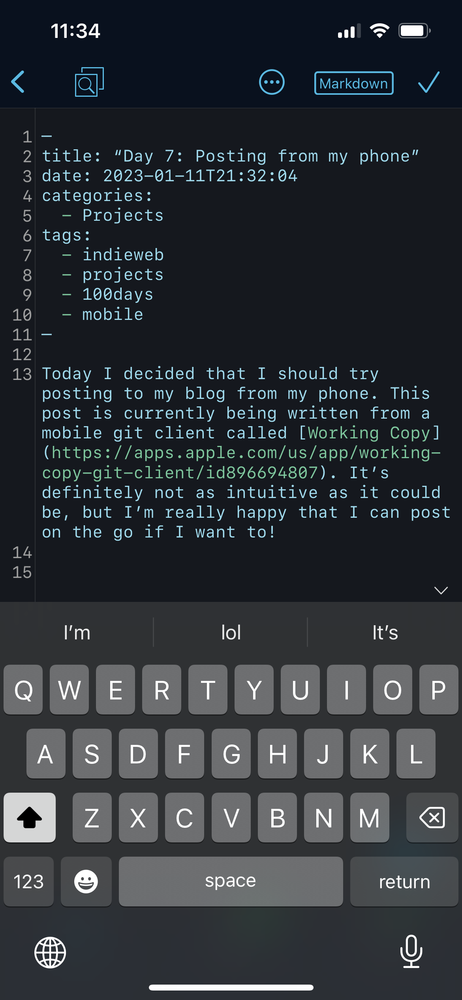

Today I decided that I should try posting to my blog from my phone. This post is currently being written from a mobile git client called [Working Copy](https://apps.apple.com/us/app/working-copy-git-client/id896694807). It’s definitely not as intuitive as it could be, but I’m really happy that I can post on the go if I want to!

I’m even able to upload images! Okay, I might actually use this more than I realized 😅

One thing I didn’t catch at first though is the frontmatter for the post didn’t get formatted correctly by default. I’ll have to keep a close eye on that.